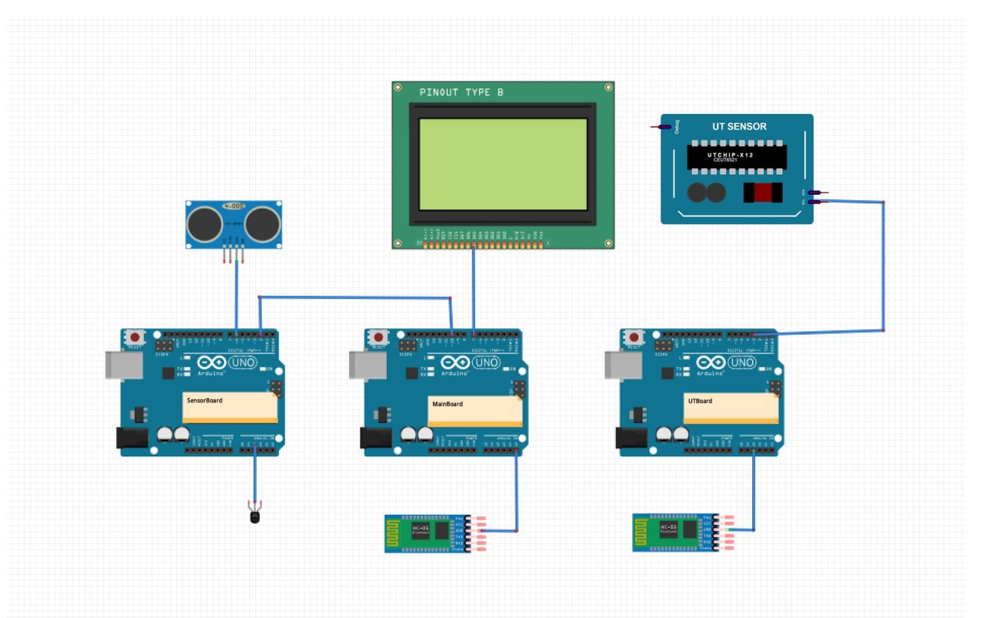

# Real-Time Embeded System Computer Assignment 2
Main goal of this computer assignment is connection between boards, like I2C and Serial.

## How it works 
It contains of three borads: main board, sensor board, and UT board. 

* Sensor board reads from heat sensor and ultra sonic sensors then send them to main board.
* UT board reads from UT sensor and send it's details to main board using bluetooth
* Main board get other boards information and show them on a LCD




## Pseudo Code 

```python
mainBoard ​{
    Initialization for Bluetooth Serial port , LCD and Software Serial Port 
    while(true)
    {
        If ( is data available from bluetooth )
            Save it in utBoard buffer;
            If ( buffer is full )
                Show utBoard buffer on LCD;
                Clean utBoard buffer;
        If ( is data available from software serial port )
            Save it in sensorBoard buffer;
            If ( reached end of message)
            Show sensorBoard buffer on LCD; Clean sensorBoard buffer;
    }
}

sensorBoard ​{
    Initialization for Serial Port and temperature sensor instantiation 
    while(true)
    {
        Read temperature value from sensor; 
        Read distance value from sensor; 
        Construct message for sending; 
        Send message to main board;
        Wait for 100 ms;
    } 
}

utBoard ​{
    Initialization for Bluetooth Serial port and I2C port and turn on UT sensor; 
    while(true)
    {
        Read the first value from sensor and store (x value);  
        Read the second value from sensor and store (y value); 
        Calculate the sigma of x^2 + y^2 and store;
        Send the previous result via bluetooth to main board; 
        Wait for 100 ms;
    } 
}

```